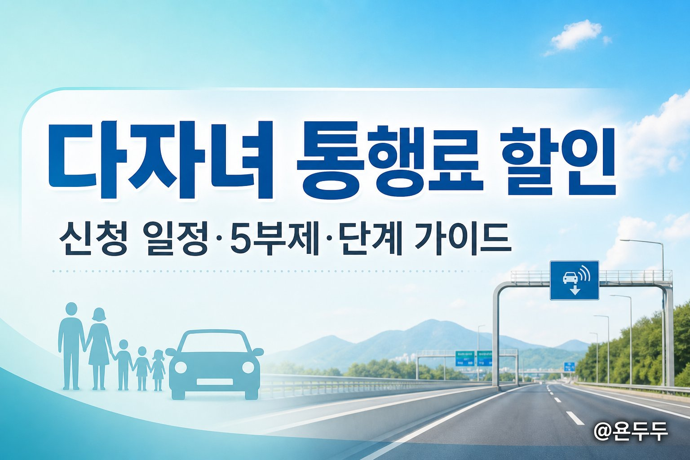
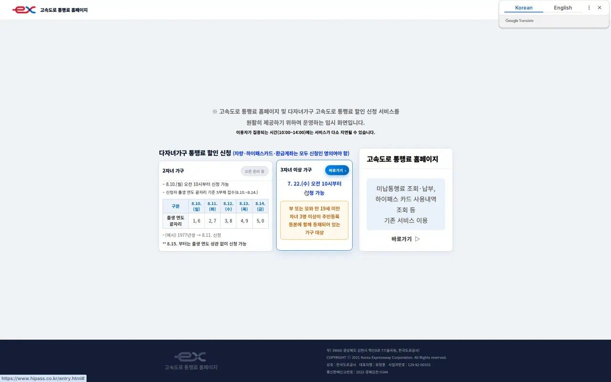
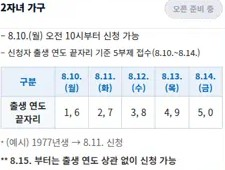
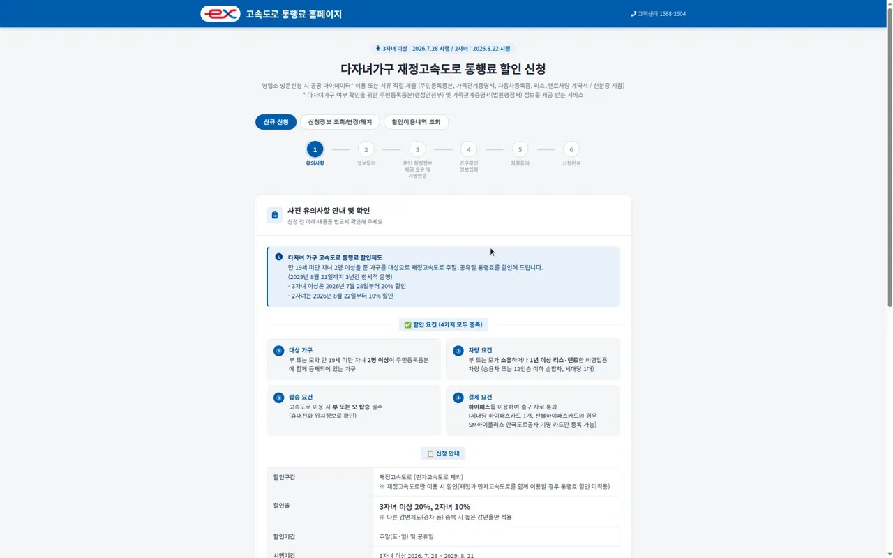
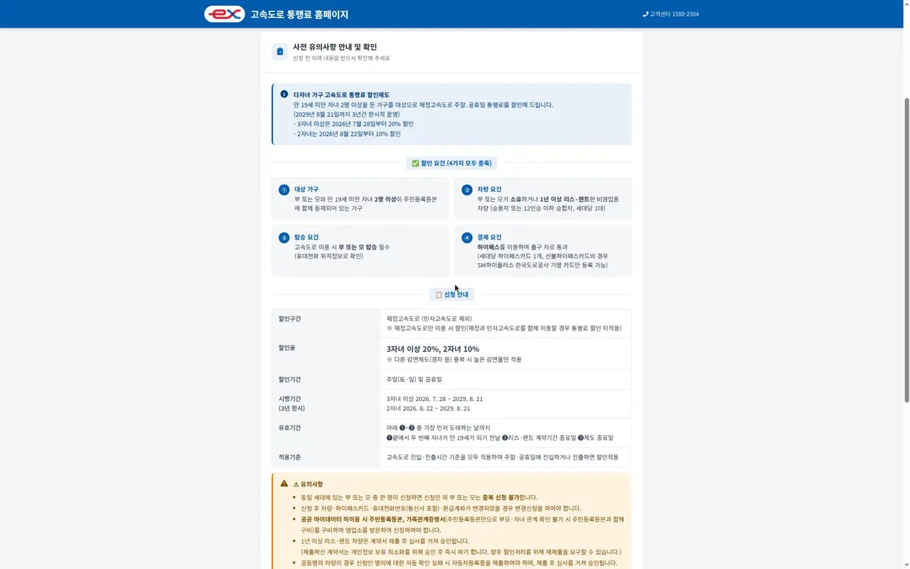
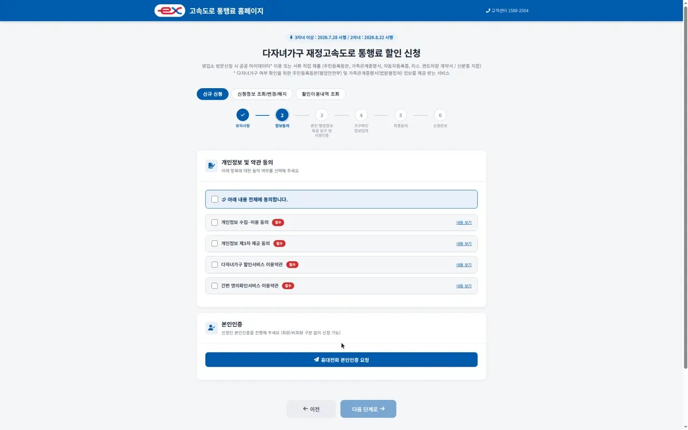

주말·공휴일마다 고속도로 통행료가 부담되던 다자녀 가정에, 2026년 하반기부터 **통행료 할인**이 열렸습니다.  
신청은 [고속도로 통행료 홈페이지(하이패스)](https://www.hipass.co.kr/entry.html)에서 하는데, 자녀 수에 따라 **신청 시작일·할인율·5부제**가 달라서 헷갈리기 쉽습니다.  
이 글은 공식 진입 화면과 신청 단계 스크린샷을 기준으로, 초보도 따라 할 수 있게 정리했습니다.

### 한 줄 요약
- **대상**: 부 또는 모 + 만 19세 미만 자녀 **2명 이상**이 주민등록등본에 함께 등재된 가구
- **할인**: 주말·공휴일, 한국도로공사 **재정고속도로** / 2자녀 **10%**, 3자녀 이상 **20%**
- **신청 오픈**: 3자녀 이상 **7.22(수) 10:00~** / 2자녀 **8.10(월) 10:00~** (8.10~8.14는 출생연도 끝자리 5부제)
- **할인 시작**: 3자녀 이상 **7.28~** / 2자녀 **8.22~** (한시 운영, **2029.8.21**까지)
- **핵심 조건**: 차량·하이패스카드·환급계좌는 **신청인 명의**, 이용 시 **부모 탑승**(휴대전화 위치 확인)

### 다자녀 통행료 할인이 뭐길래?
쉽게 말하면, “아이들이 둘 이상인 집이 주말·공휴일에 고속도로를 탈 때 요금을 깎아 주는” 제도입니다.

- 평일에는 적용되지 않고, **토·일·공휴일**에 해당합니다.
- 할인 대상 도로는 **한국도로공사가 운영하는 재정고속도로**입니다. 민자고속도로만 타거나, 민자와 연계되는 이용에서는 할인이 제한될 수 있습니다.
- 신청만 해 두고 끝이 아니라, 등록한 **하이패스 카드**로 통과하고, **신청한 부모(부 또는 모)가 함께 탑승**해야 합니다.

국토교통부·보도에 따르면 이 제도는 **3년 한시**(2029년 8월 21일까지)로 운영된 뒤, 재정 여건 등을 보고 연장 여부를 검토한다고 합니다.

### 신청 일정과 출생연도 끝자리 5부제 표
공식 진입 페이지([hipass.co.kr/entry.html](https://www.hipass.co.kr/entry.html)) 기준입니다.

| 구분 | 신청 시작 | 할인 적용 시작 | 할인율 |
| --- | --- | --- | --- |
| 3자녀 이상 가구 | 2026.7.22(수) 오전 10시 | 2026.7.28~ | 20% |
| 2자녀 가구 | 2026.8.10(월) 오전 10시 | 2026.8.22~ | 10% |

**2자녀 가구**는 오픈 직후 5일간 **신청자 출생 연도 끝자리 5부제**로 받습니다.

| 구분 | 8.10(월) | 8.11(화) | 8.12(수) | 8.13(목) | 8.14(금) |
| --- | --- | --- | --- | --- | --- |
| 출생 연도 끝자리 | 1, 6 | 2, 7 | 3, 8 | 4, 9 | 5, 0 |

- 예시: **1977년생** → 끝자리 7 → **8.11(화)** 신청
- **8.15부터**는 출생 연도와 관계없이 신청 가능
- 이용자가 몰리는 **10:00~14:00**에는 접속·대기가 느릴 수 있습니다

### 신청 전에 체크할 4가지 요건
공식 신청 화면의 유의사항에 나오는 핵심입니다. **네 가지를 모두** 충족해야 할인됩니다.

1. **대상 가구**: 부 또는 모와 만 19세 미만 자녀 2명 이상이 주민등록표(등본)에 함께 등재
2. **차량 요건**: 부모 소유(또는 1년 이상 리스·렌트) 비영업용 **승용차·12인승 이하 승합**, 가구당 **1대**
3. **탑승 요건**: 고속도로 이용 시 **부 또는 모가 차량에 탑승**(사전 등록 휴대전화 위치 조회)
4. **결제 요건**: 등록한 **하이패스 카드**로 하이패스 차로 통과(가구당 카드 1개)

추가로 진입 페이지에 명시된 중요 문구:
> 차량·하이패스카드·환급계좌는 **모두 신청인 명의**여야 함

### 단계별 신청 방법 (스크린샷)

#### STEP 1. 공식 진입 페이지 접속
1. 브라우저에서 [https://www.hipass.co.kr/entry.html](https://www.hipass.co.kr/entry.html) 접속  
2. 자녀 수에 맞는 칸을 확인합니다.  
   - **3자녀 이상**: `바로가기` (7.22부터 가능)  
   - **2자녀**: 8.10 전까지는 `오픈 준비 중`으로 보일 수 있음  
3. 미납 조회 등 기존 서비스는 아래쪽 `기존 서비스 이용 바로가기`로 들어갑니다.

사람이 많으면 **대기열(대기번호·현재 순위)** 화면이 먼저 뜹니다. 브라우저를 닫으면 대기가 취소되니, 순번이 올 때까지 창을 유지하세요.

#### STEP 2. 유의사항 확인 (신청 1단계)
`바로가기` 후에는 **다자녀가구 재정고속도로 통행료 할인 신청** 화면으로 이동합니다.  
상단 진행 표시는 대략 이렇게 이어집니다.

1. 유의사항  
2. 정보동의  
3. 본인 행정정보 제공 요구 및 서명인증  
4. 가구확인 정보입력  
5. 최종동의  
6. 신청완료  

이 화면에서 할인율·적용 기간·재정고속도로 안내를 먼저 읽고, 아래로 내려 **4가지 요건**과 유의사항을 확인한 뒤 다음으로 갑니다.

유의사항에서 자주 놓치는 포인트:
- 한 가구에서 **부·모 중복 신청 불가**(한 명만)
- 차량·하이패스·휴대번호가 바뀌면 **다시 신청**이 필요할 수 있음
- 온라인에서 **공공 마이데이터**를 쓰면 주민등록등본 등 서류 제출을 줄일 수 있음
- 영업소 방문 신청도 가능(서류 지참)

#### STEP 3. 정보동의 + 본인인증 (신청 2단계)
다음 단계는 **약관 동의**와 **휴대전화 본인인증**입니다.

1. `전체 동의` 또는 필수 항목을 하나씩 체크  
   - 개인정보 수집·이용  
   - 제3자 제공  
   - 다자녀 할인 서비스 이용약관  
   - 간편 본인인증 이용약관 등  
2. `휴대전화 본인인증 요청` 버튼으로 본인 확인  
3. 인증이 끝나면 `다음 단계로`

회원·비회원 모두 신청할 수 있다고 안내되어 있습니다.  
(본인인증 이후 단계는 개인정보가 필요해, 이 글에서는 실제 제출 화면까지는 진행하지 않았습니다.)

#### STEP 4. 행정정보·가구 확인 → 최종 제출
본인인증 이후에는 대략 다음 순서로 이어집니다.

1. **행정정보 제공 요구·서명인증** — 공공 마이데이터로 가구 정보를 확인하거나, 안 되면 서류 제출  
2. **가구확인 정보입력** — 차량·하이패스 카드·환급 계좌·휴대전화 등을 등록  
3. **최종동의** — 입력 내용 재확인  
4. **신청완료**

신청이 끝난 뒤에는 같은 사이트 메뉴의  
`신청정보 조회/변경/취소`, `할인내역 조회`에서 상태를 확인할 수 있습니다.

### 할인받는 날, 이렇게 이용하세요
신청만 하고 끝이 아닙니다. 실제 주행 때 아래를 지키면 됩니다.

1. 등록한 **하이패스 카드**를 단말기에 넣고 하이패스 차로로 통과  
2. **신청한 부모**가 함께 탑승 (출구 통과 시 등록 휴대전화 위치 확인)  
3. **주말·공휴일** 이용인지 확인  
4. 선불 하이패스는 등록 환급계좌로 **사후 정산**, 후불은 청구 과정에서 할인 반영되는 방식으로 안내됩니다

다른 할인(예: 경차 할인)과 겹치면 **가장 높은 할인율 하나만** 적용되는 경우가 있습니다.

### 자주 묻는 질문 (FAQ)

**Q1. 2자녀인데 지금(7월) 바로 신청되나요?**  
A. 공식 진입 페이지 기준으로 2자녀는 **8.10(월) 오전 10시**부터입니다. 그전까지는 `오픈 준비 중`으로 보일 수 있어요. 3자녀 이상은 7.22부터 신청이 열려 있습니다.

**Q2. 평일에도 할인되나요?**  
A. 아니요. **토·일·공휴일**에 적용됩니다. 평일 통행에는 이 다자녀 할인이 적용되지 않습니다.

**Q3. 민자고속도로에서도 되나요?**  
A. 대상은 한국도로공사 **재정고속도로**입니다. 민자고속도로만 이용하거나 민자와 연계되는 경우에는 할인이 제한될 수 있으니, 신청 화면의 유의사항을 꼭 확인하세요.

**Q4. 아이만 태우고 가도 할인되나요?**  
A. 공식 안내상 **신청한 부 또는 모가 탑승**해야 합니다. 부모 없이 자녀만 탑승하면 할인 요건을 충족하지 못할 수 있습니다.

**Q5. 차량·카드·계좌 명의가 달라도 되나요?**  
A. 진입 페이지에 **차량·하이패스카드·환급계좌는 모두 신청인 명의**여야 한다고 명시되어 있습니다. 공동명의 차량 등은 자동차등록증 등 추가 서류가 필요할 수 있습니다.

### 관련 소식
- 신청 진입(공식): [고속도로 통행료 홈페이지 / 다자녀 할인 신청](https://www.hipass.co.kr/entry.html)
- 경향신문: [자녀 2명 이상이면 주말·공휴일 고속도로 요금 할인…](https://www.khan.co.kr/article/202607211517001)
- 한겨레: [2자녀 이상 가구, 주말·휴일 고속도로 통행료 할인 받는다](https://www.hani.co.kr/arti/society/society_general/1269197.html)
- KBS: [다자녀 고속도로 통행료 10~20% 할인…](https://news.kbs.co.kr/news/view.do?ncd=8615971)

### 한눈에 정리
1. 3자녀 이상은 **지금 신청 가능**(7.22~), 할인은 **7.28부터 20%**  
2. 2자녀는 **8.10 10시**부터 신청, **8.10~8.14는 출생연도 끝자리 5부제**, 할인은 **8.22부터 10%**  
3. 신청 경로: [hipass.co.kr/entry.html](https://www.hipass.co.kr/entry.html) → 유의사항 → 동의·본인인증 → 가구·차량·카드 등록  
4. 이용 시 **등록 하이패스 + 부모 탑승 + 주말·공휴일**을 지켜야 함  
5. 제도는 **2029.8.21까지** 한시 운영(이후 연장 여부는 정부 검토)

이 글은 공식 페이지·보도를 바탕으로 한 **생활 정보 안내**이며, 일정·요건은 변경될 수 있으니 신청 직전 공식 화면을 다시 확인해 주세요.
