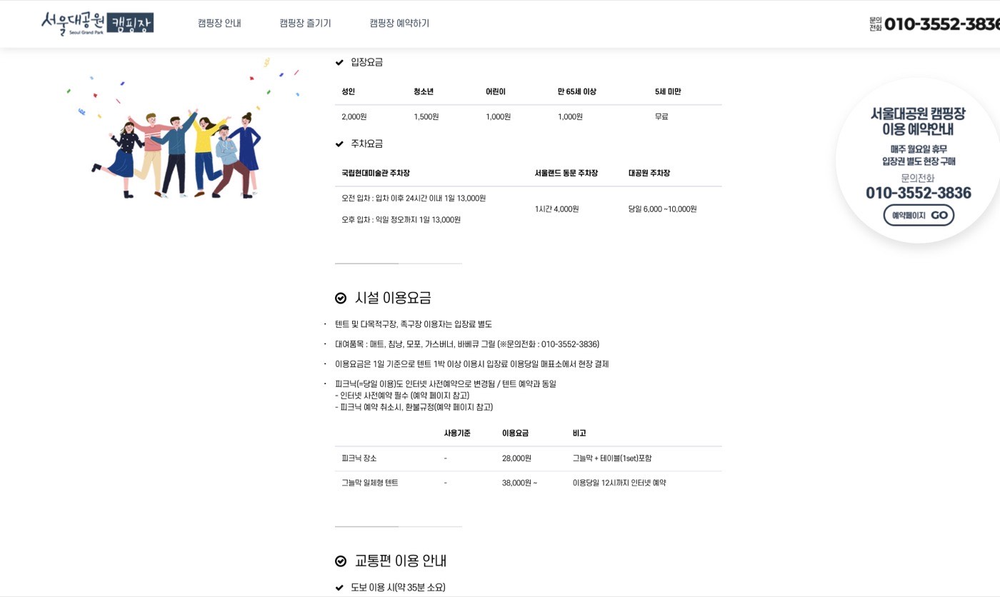
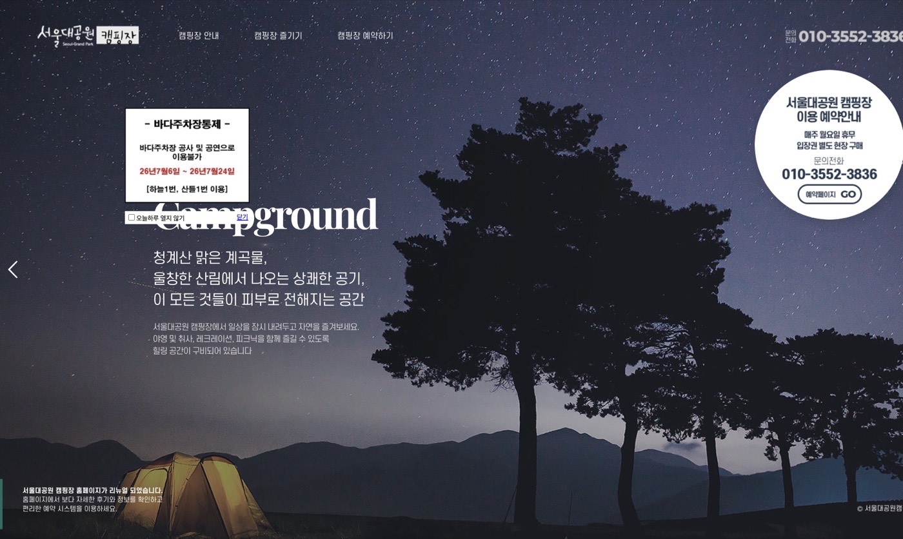
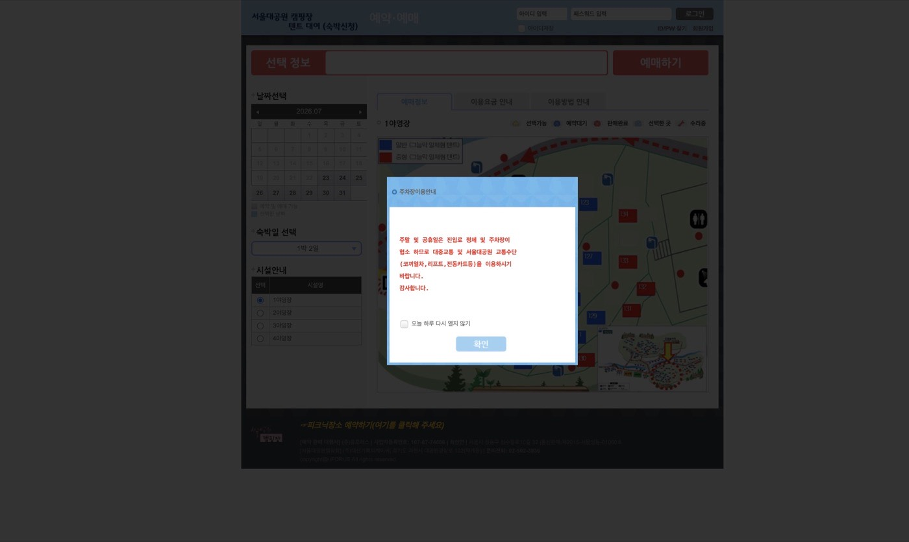
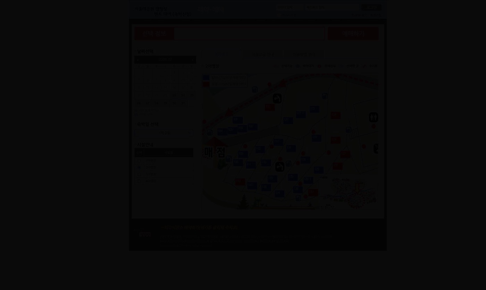
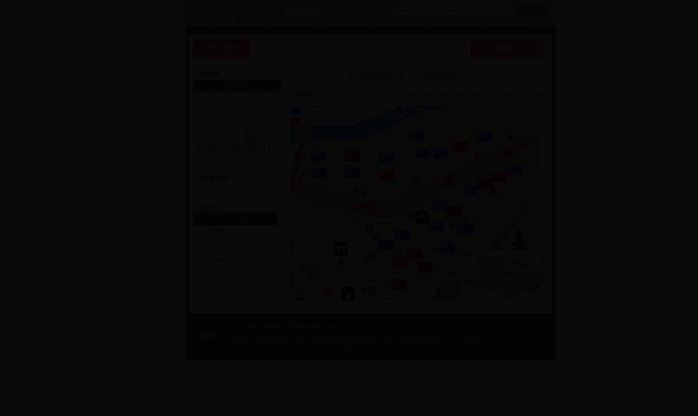
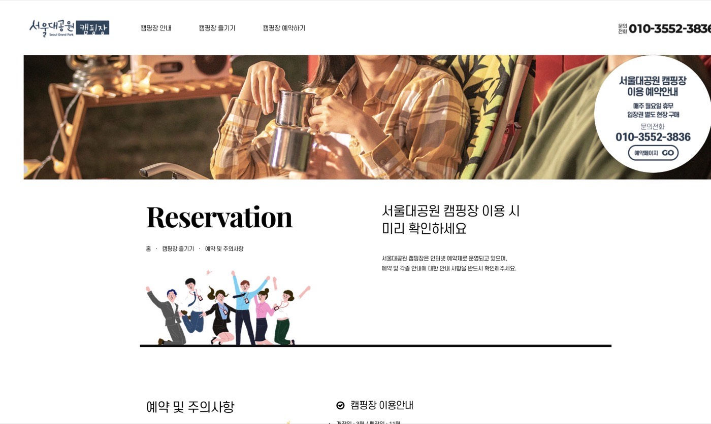

서울 근교에서 계곡·그늘을 같이 즐길 수 있는 **서울대공원 캠핑장**은 인기가 많아서, 처음이면 “언제 열고, 어디를 누르고, 결제는 언제까지?”가 제일 헷갈립니다. 이 글은 공식 안내(예약·주의사항)와 실제 예약 화면을 기준으로, **초보도 따라 할 수 있게** 단계별로 정리했습니다.

### 한 줄 요약
- **예약**: 인터넷 전용 (회원가입·로그인 필요)
- **오픈**: 이용월의 **전달 15일 오후 2시** (예: 8월분 → 7월 15일 14:00)
- **핵심**: 미리 로그인 → 팝업 닫기 → 날짜·구역·자리 바로 클릭 → **2시간 안** 결제
- **당일**: 입장권은 **현장 구매**, 방문자센터에서 본인확인 후 이용

### 예약 전에 꼭 알아둘 기본 정보
공식 안내 기준으로 먼저 체크하세요.

| 항목 | 내용 |
| --- | --- |
| 운영 기간 | 3월 개장 ~ 11월 폐장 |
| 휴장 | **매주 월요일** (월요일이 휴일이면 익일 휴장 등 예외 있음) |
| 텐트(숙박) | 당일 12:00 입실 ~ 다음날 10:00 퇴실 |
| 피크닉(당일) | 09:00 입장 ~ 19:00 퇴장, **사전 예약 필수** |
| 예약 한도 | 이용일 기준 1일 최대 **2동** |
| 결제 | 신용카드 / 가상계좌 (신청 후 **2시간 내**, 당일 예약은 **1시간 내**) |
| 변경 | 자리·일수 부분 변경 불가 → **전체 취소 후 재예약** |

요금은 변동될 수 있으니, 예약 직전 공식 페이지를 한 번 더 확인하세요. (글 작성 시점 기준 예시)

| 구분 | 요금(예시) | 비고 |
| --- | --- | --- |
| 그늘막 일체형 텐트 | 38,000원~ | 이용 당일 12시까지 인터넷 예약 |
| 피크닉 장소 | 28,000원 | 그늘막+테이블 1세트 포함 |
| 입장료(성인) | 2,000원 | 청소년/어린이 별도, **현장 구매** |

공식 홈 우측의 **「예약페이지 GO」** 또는 메뉴 **「캠핑장 예약하기」**로 들어가면 예약 시스템으로 이동합니다.

예약 사이트: [서울대공원 캠핑장 공식 홈](http://www.seoulcamp.co.kr/)  
예약·주의사항: [공식 예약 및 주의사항](http://www.seoulcamp.co.kr/page/sub03_01)

---

### STEP 0. 오픈 전에 할 일 (성공 확률 올리는 준비)
인기일은 **15일 14:00 정각**에 서버가 붐빕니다. 오픈 직전 5~10분 전에 아래를 끝내 두세요.

1. **회원가입·로그인**해 두기  
2. 원하는 **날짜 / 야영장(1~4) / 선호 자리 기준**을 미리 정하기  
   - 여름: 계곡이 가까운 **2야영장**을 많이 선호  
   - 봄·가을: 놀이터·그늘이 좋은 **3야영장**을 선호하는 경우도 많음  
   - 자리: 개수대·조명·화장실과의 거리도 같이 보세요  
3. 팝업이 뜨면 **「오늘 하루 다시 열지 않기」** 후 확인으로 치워 두기  
4. 시계는 네이버 등 **표준시**로 맞춰 두고, 14:00에 새로고침

> TIP: 예약하면서 “어느 자리가 좋지?”를 고민하면 늦습니다. **고민은 오픈 전에, 클릭은 오픈 후에.**

---

### STEP 1. 예약 시스템 들어가기
공식 홈에서 **예약페이지 GO**를 누르면 예약 화면(텐트 대여/숙박신청)이 열립니다.  
처음 들어오면 주차·이용 관련 **팝업이 여러 개** 뜰 수 있어요. 하나씩 확인하고 닫은 뒤 본 화면을 보세요.

팝업에 나오는 핵심 메시지는 이렇습니다.

- 주말·공휴일은 **진입로 정체 + 주차 협소**
- 가능하면 **대중교통** 또는 코끼리열차·리프트·전동카트 이용 권장

오른쪽 위에는 **로그인** 칸이 있습니다. 로그인하지 않으면 예약을 끝까지 못 하니, 오픈 전에 꼭 로그인해 두세요.

---

### STEP 2. 날짜 · 숙박일 · 야영장 선택
왼쪽 패널 순서대로 고릅니다.

1. **날짜선택**: 달력에서 이용일 클릭  
2. **숙박일 선택**: 보통 `1박 2일`  
3. **시설안내**: `1야영장` ~ `4야영장` 중 하나 선택  
   - 기본값이 1야영장인 경우가 많으니, 원하는 구역이 다르면 **반드시 다시 선택**

---

### STEP 3. 지도에서 자리(사이트) 클릭
오른쪽 지도에 번호 붙은 자리가 보입니다. 색/아이콘으로 상태를 구분합니다.

- **선택 가능**: 클릭해서 고를 수 있는 자리  
- **판매완료/예약완료**: 이미 나간 자리  
- **예약대기 / 수리중**: 당장은 선택 불가인 경우

원하는 파란(가능) 자리를 **바로 클릭**한 뒤, 상단의 빨간 **「예매하기」**를 누릅니다.

자동입력 방지문자(캡차)가 나오면 **오타 없이** 입력하세요. 여기서 한 번 틀리면 다시 자리를 잡아야 할 수 있습니다.

---

### STEP 4. 결제까지 끝내야 진짜 예약 완료
자리만 잡았다고 끝이 아닙니다.

- 일반: 예약 신청 후 **2시간 이내** 미결제 시 자동 취소  
- 사용 당일 예약: **1시간 이내** 미입금 시 자동 취소  
- 결제 수단: 신용카드 또는 가상계좌  
- 확인: 로그인 → **내정보 → 예매목록**

피크닉(당일 이용)도 같은 예약 시스템에서 따로 신청합니다. 당일 09:00~19:00, 사전 예약 후 매표소에서 입장권을 구매해야 합니다.

---

### STEP 5. 당일 이용 절차
1. 매표소에서 **입장권 현장 구매**  
2. **방문자센터에서 본인확인** 후 이용  
3. 예약확인증 또는 휴대폰 안내 문자를 준비해 두면 편합니다  
4. 입실 전(12:00 이전)에 텐트 주변에 짐을 미리 내려놓거나, 퇴실을 재촉하는 행동은 피해주세요

---

### 예약 성공 체크리스트 (복붙용)
1. 미리 로그인  
2. 팝업 치우기  
3. 15일 **14:00 정각** 새로고침  
4. 날짜·야영장·자리 **고민 없이 클릭**  
5. 캡차 정확히 입력  
6. **2시간 안** 결제

---

### 이용 시 주의사항 (공식 안내 요약)
아래는 공식 「예약 및 주의사항」을 초보 기준으로 짧게 옮긴 내용입니다. 상세는 반드시 [공식 페이지](http://www.seoulcamp.co.kr/page/sub03_01)를 확인하세요.

**안전·이용**
- 서울대공원은 **금연 공원** (적발 시 과태료)
- 텐트 안 **버너·촛불·모기향 등 화기 금지**
- 야영장 내 **모닥불 금지** (위반 시 강제 퇴실 가능)
- 앰프·스피커, 출장음식, 개인 천막·그늘막 사용 불가
- **애완동물·자전거·퀵보드 출입 금지**
- 화장실 등 시설 전기 **무단 사용 금지**
- 모험놀이터·계곡은 보호자 동반, 놀이터 내 취사 금지
- 23:30 이후 공원등(화장실 제외) 일괄 소등
- 귀중품 분실·도난은 보상되지 않음

**예약·환불**
- 취소는 사용일 **1일 전**까지 온라인으로
- 통장 환불 시 CMS 이체 수수료 **500원(고객 부담)** 가능
- 천재지변 등으로 운영 불가 시 관리자가 일괄 취소할 수 있음

**주차 TIP**
- 캠핑장·미술관 쪽 주차는 사이트 수 대비 여유가 적은 편입니다  
- 주말은 이른 도착(가능하면 오전) 또는 대중교통이 훨씬 수월합니다  
- 캠핑장이 산쪽에 있어 **짐 동선에 경사**가 있을 수 있어요

---

### 자주 묻는 질문 (FAQ)
**Q. 예약은 언제 열리나요?**  
A. 이용 기간(3~11월) 기준으로 **전달 매월 15일 오후 2시**에 다음 달분이 열립니다. 15일이 공휴일이면 익일 평일에 열리는 경우가 있으니, 당일 공지를 한 번 더 확인하세요.

**Q. 자리 변경이 되나요?**  
A. 부분 변경은 안 됩니다. 전체 취소 후 다시 예약해야 합니다.

**Q. 입장료도 온라인으로 내나요?**  
A. 아니요. 텐트/피크닉 이용자는 **입장권을 당일 현장에서** 구매합니다.

**Q. 피크닉만 가도 예약이 필요하나요?**  
A. 네. 피크닉도 인터넷 사전예약제입니다.

**Q. 반려견과 함께 갈 수 있나요?**  
A. 공식 안내상 캠핑장 내 애완동물 출입이 금지입니다.

---

### 관련 링크
- 공식 홈: http://www.seoulcamp.co.kr/
- 예약 및 주의사항: http://www.seoulcamp.co.kr/page/sub03_01
- 이용요금·교통안내: http://www.seoulcamp.co.kr/page/sub03_03
- 예약 과정 참고(개인 후기): https://m.blog.naver.com/hi141105/223073155329

### 한눈에 정리
1. 전달 15일 14:00 오픈, 미리 로그인  
2. 팝업 닫고 날짜·야영장·자리 바로 선택  
3. 예매하기 → 캡차 → **2시간 안 결제**  
4. 당일 입장권 현장 구매 + 본인확인  
5. 금연·화기·반려동물·주차 혼잡 주의

문의: 공식 안내 번호 **010-3552-3836** (안내 변동 가능)

> 이 글은 공식 안내와 공개된 예약 화면을 바탕으로 한 **정보성 가이드**입니다. 요금·일정·운영 규정은 변경될 수 있으니, 예약 직전 공식 사이트 공지를 최종 확인해 주세요.
