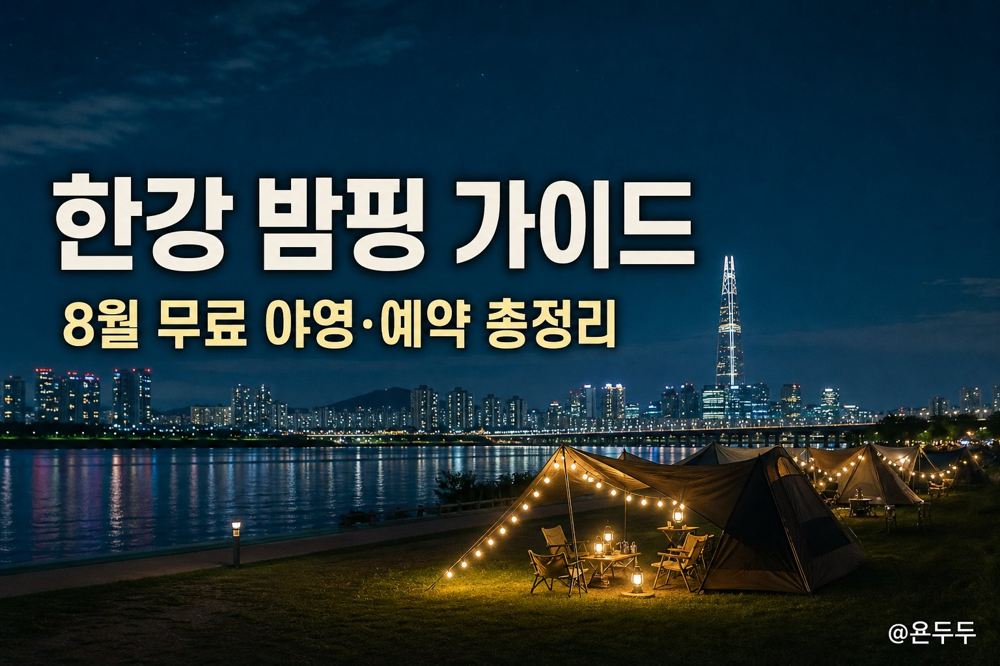
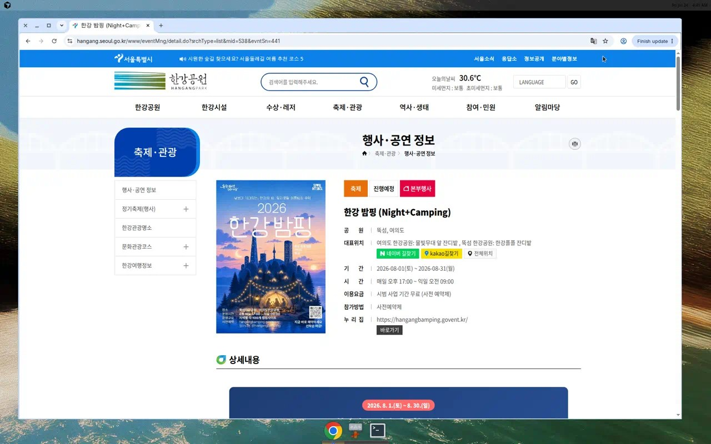
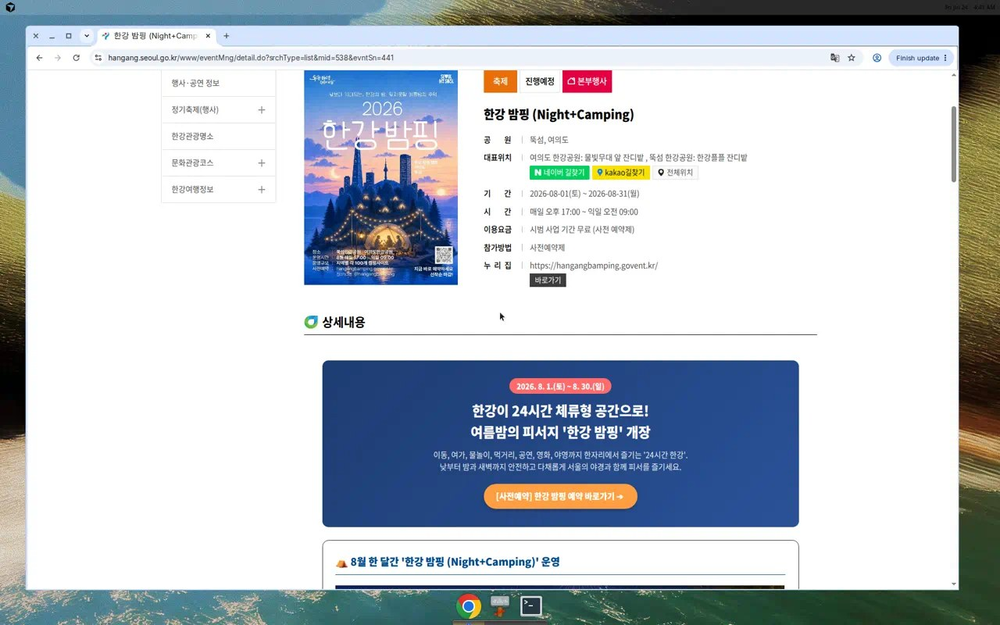
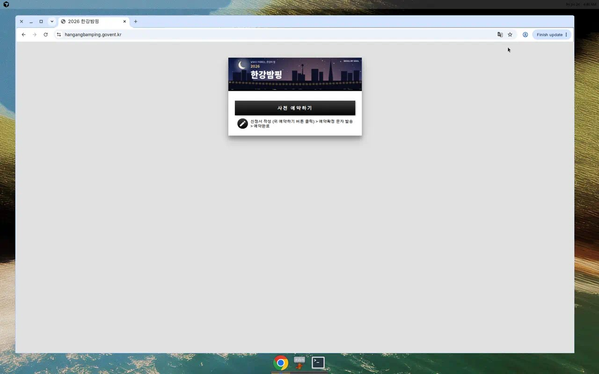
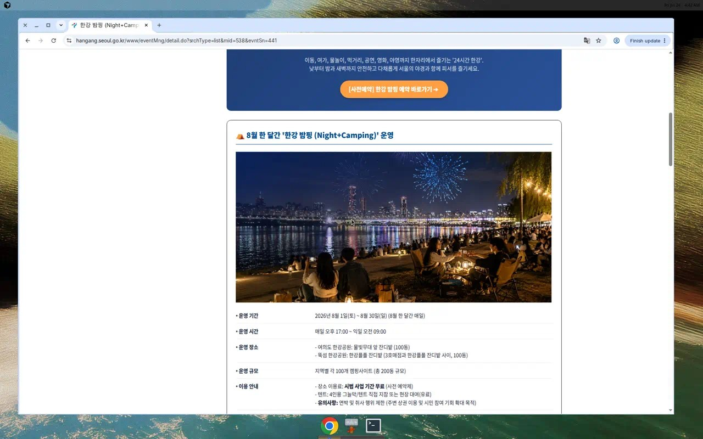
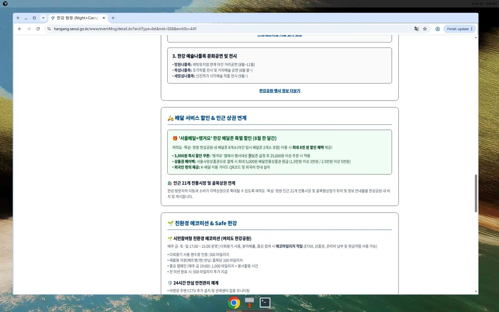

한강에서 “밤부터 아침까지” 텐트를 치고 머무를 수 있는 임시 야영장, **한강 밤핑(Night+Camping)** 소식이 2026년 7월 23일 공개됐습니다. 예전에는 지정 캠핑장(난지 등) 말고는 한강공원에서 밤샘 야영이 어려웠는데, 이번엔 여의도·뚝섬에 한시적으로 문을 엽니다. 이 글은 공식 안내를 기준으로 일정·장소·예약·주의사항을 **표와 스크린샷**으로 정리했습니다.

### 한 줄 요약
- **기간**: 2026년 8월 1일(토) ~ 8월 30일(일), 매일
- **시간**: 오후 5시 ~ 다음 날 오전 9시
- **장소**: 여의도·뚝섬 한강공원 (각 100동, 총 200동)
- **이용료**: 시범 기간 **장소 이용 무료** (사전 예약 필수)
- **주의**: **연박·취사 제한**, 텐트는 지참 또는 현장 유료 대여

### 밤핑이 뭐예요?
**밤핑**은 Night(밤) + Camping(캠핑)을 합친 말입니다.  
쉽게 말하면 “한강 지정 잔디밭에 텐트를 치고, 밤부터 아침까지 머무르는 임시 야영”입니다.

일반 캠핑장과 다른 점은 이렇습니다.

| 구분 | 한강 밤핑(이번) | 일반 캠핑장(예: 난지) |
| --- | --- | --- |
| 성격 | 여름 한 달 시범·임시 야영 | 상시(또는 시즌) 캠핑장 |
| 장소 이용료 | 시범 기간 무료 | 보통 유료 |
| 취사 | 제한(금지로 안내) | 시설에 따라 가능/제한 |
| 연박 | 제한 | 보통 가능(예약 조건 따름) |
| 예약 | 민간 플랫폼 사전예약 | 각 캠핑장 예약 시스템 |

서울시 설명에 따르면, 난지캠핑장은 인기가 많아 예약이 어렵고, 이번 밤핑은 “여름 성수기 특별 지정 구역”을 열어 저녁~새벽 이용 기회를 넓히려는 취지입니다. (연합뉴스 2026-07-23 보도)

### 기본 정보 한눈에 (표)
공식 행사 페이지(미래한강본부) 상세 안내 기준입니다.

| 항목 | 내용 |
| --- | --- |
| 행사명 | 한강 밤핑 (Night+Camping) |
| 운영 기간 | 2026. 8. 1.(토) ~ 8. 30.(일) (매일) |
| 운영 시간 | 매일 17:00 ~ 익일 09:00 |
| 운영 장소 | 여의도 한강공원 물빛무대 앞 잔디밭(100동), 뚝섬 한강공원 한강플플 잔디밭(100동) |
| 규모 | 총 200동 |
| 이용료 | 시범 사업 기간 **무료** (사전 예약제) |
| 텐트 | 4인용 그늘막/텐트 **직접 지참** 또는 **현장 대여(유료)** |
| 유의사항 | **연박·취사 행위 제한** |
| 예약 사이트 | https://hangangbamping.govent.kr/ |
| 공식 안내 | https://hangang.seoul.go.kr/www/eventMng/detail.do?srchType=list&mid=538&evntSn=441 |

### 왜 지금 이슈인가
서울시는 한강을 **24시간 체류형 공간**으로 만들겠다는 “야간경제” 구상 속에 밤핑을 첫 무대로 올렸습니다.  
수영장 야간 개장, 한강페스티벌 공연·영화, 배달 할인, 인근 전통시장 안내까지 묶어서 “낮부터 새벽까지 머물며 즐기는” 흐름을 만들겠다는 설명입니다.

머니투데이 등 보도에 따르면, 한강공원 임시 캠핑은 과거에도 운영된 적이 있으나 2018년 이후 끊겼고, 이번이 약 8년 만의 한시 개방으로 전해집니다. 다만 **한강공원 전역 야영 금지 원칙은 유지**하고, 여의도·뚝섬 임시 야영장만 허용하는 방식입니다.

### 예약은 어떻게 하나요
공식 안내상 **사전 예약제**입니다. 예약 사이트는 GOVENT 기반의 `hangangbamping.govent.kr`입니다.

예약 화면에는 대략 이런 순서가 안내됩니다.

1. **사전 예약하기** 버튼 클릭 → 신청서 작성  
2. **예약확정 문자** 발송  
3. **예약완료**

#### 예약 전 체크리스트
| 체크 | 내용 |
| --- | --- |
| □ | 날짜·장소(여의도/뚝섬)를 미리 정했는지 |
| □ | 텐트를 가져갈지, 현장 대여할지 결정했는지 |
| □ | 취사·연박이 안 된다는 점을 일행과 공유했는지 |
| □ | 인근 먹거리(배달존/상권) 계획을 짜 뒀는지 |
| □ | 공식 페이지에서 일정·유의사항이 바뀌지 않았는지 재확인 |

> 예약 오픈 시각·1인당 가능 일수·취소 규정은 플랫폼 안내에 따를 수 있으니, 신청 직전 예약 사이트 공지를 한 번 더 보세요.

### 같이 즐길 수 있는 프로그램 (표로 정리)
밤핑만 가는 것도 가능하지만, 공식 안내는 수영장·축제·공연과 “연계”를 강조합니다.

#### 1) 수영장·물놀이장 야간 이용
| 항목 | 내용 |
| --- | --- |
| 야간 개장 | 여의도·뚝섬 수영장, 잠실·난지 물놀이장 |
| 기간·시간 | 2026. 7. 3. ~ 8. 30. 매일 09:00 ~ 22:00 |
| 여의도 야간 디제잉 | 7. 24.(금) ~ 8. 30.(일), 매주 금·토·일 (종료 21:00까지 연장) |
| 난지 야간 디제잉 | 8. 8.(토)부터 매주 토요일 19:00 ~ 21:00 |

#### 2) 2026 한강페스티벌_여름 주요 행사
| 행사 | 일정·장소(공식 안내) |
| --- | --- |
| 한강 다리 밑 영화관 | 여의도 원효대교 하부 8.8/8.15/8.22(토) 20~22시 / 뚝섬 청담대교 하부 8.8/8.15(토) 20~22시 |
| 한강 나이트워크 42K | 8. 1.(토) 16:00 ~ 익일 08:00, 여의도 녹음수광장 출발 |
| 무소음 DJ파티 | 8.1 / 8.8 / 8.15(토) 19:00 ~ 22:00, 여의도 마포대교 하부 |
| 빅뱅 20주년 리스닝 파티 | 8. 19.(수) 20:00 ~ 21:00, 여의도 물빛무대 앞 |
| 서울함 워터피크닉 | 8. 1.(토) 11:00 ~ 17:00, 망원 서울함공원 |
| 한강무박2일 | 8. 8.(토) 20:00 ~ 익일 05:00, 망원 서울함공원 일원 |

#### 3) 배달 할인·상권 연계
| 항목 | 내용 |
| --- | --- |
| 대상 | 여의도·뚝섬·망원 한강공원 배달존 8개소(야간 임시 배달존 2개소 포함) |
| 기간 | 8월 한 달 |
| 혜택 규모 | 최대 약 8천 원 상당(쿠폰+페이백 조합) |
| 즉시 할인 | 땡겨요 앱에서 행사 배달존 설정 후 25,000원 이상 주문 시 3,000원 |
| 상품권 페이백 | 서울사랑상품권 결제 시 배달전용상품권 환급(1.5만원↑ 3천원 / 2.5만원↑ 5천원) |
| 상권 안내 | 인근 21개 전통시장·골목상권 위치 안내물 비치 |

#### 4) 에코미션·안전 관리
| 구분 | 내용 |
| --- | --- |
| 에코미션 운영 | 여의도, 매주 금·토·일 17:00 ~ 21:00 |
| 다회용기 영수증 인증 | 500 마일리지 |
| 페트병/캔 반납 | 품목당 100 마일리지 |
| 줍깅(매주 금 19:00) | 1,000 마일리지 + 봉사활동 시간 |
| 전 미션 완료 | 500 마일리지 추가 |
| 안전 | CCTV 추가·관제, 조도 개선, 보안관·관리인력 상근, 청소·화장실 인력 보강 |

### 현장에서 헷갈리기 쉬운 점
1. **장소가 무료 ≠ 텐트까지 무료**  
   자리(사이트) 이용료는 시범 기간 무료지만, 텐트 대여는 유료일 수 있습니다.
2. **취사가 안 됩니다**  
   바비큐·버너 대신 배달·주변 상권·준비해 온 음식이 현실적입니다. (공식·보도 모두 취사 제한 안내)
3. **아무 잔디에나 치면 안 됩니다**  
   지정된 여의도·뚝섬 임시 야영장만 허용입니다. 그 외 구역 야영은 기존처럼 단속 대상이 될 수 있습니다.
4. **연박이 제한됩니다**  
   “며칠 연속으로 자리 잡기”보다, 하루 단위로 더 많은 시민이 쓰게 하려는 취지로 이해하면 됩니다.

### 자주 묻는 질문 (FAQ)
**Q1. 돈 안 내고 자도 되나요?**  
시범 사업 기간 **장소 이용료는 무료**입니다. 다만 **사전 예약**이 필요하고, 텐트를 빌리면 별도 비용이 들 수 있습니다.

**Q2. 텐트 없어도 갈 수 있나요?**  
가능합니다. 공식 안내는 4인용 그늘막/텐트를 **직접 가져오거나 현장에서 유료 대여**할 수 있다고 안내합니다. 대여 수량·요금은 현장/예약 공지를 확인하세요.

**Q3. 불·버너로 요리해도 되나요?**  
안 됩니다. **취사 행위가 제한**됩니다. 배달 할인·인근 상권 이용을 염두에 두는 편이 좋습니다.

**Q4. 아이·반려동물과 가능한가요?**  
공식 상세 페이지 본문만으로는 연령·반려동물 세부 규정이 충분히 보이지 않습니다. 예약 사이트 유의사항과 현장 안내를 기준으로 확인하세요.

**Q5. 난지캠핑장과 같이 쓸 수 있나요?**  
난지는 상시 캠핑장, 밤핑은 여의도·뚝섬 임시 야영입니다. 목적·규칙이 다르니 각각 따로 예약·확인해야 합니다.

### 관련 소식
- [한강 밤핑 공식 행사 안내 (미래한강본부)](https://hangang.seoul.go.kr/www/eventMng/detail.do?srchType=list&mid=538&evntSn=441)
- [한강 밤핑 사전예약 사이트](https://hangangbamping.govent.kr/)
- [연합뉴스: 여의도·뚝섬 텐트 200동 야영장…야간경제 활성화](https://www.yna.co.kr/view/AKR20260723088651004)
- [경향신문: 여의도·뚝섬 한강공원에 무료 야영장](https://www.khan.co.kr/article/202607232123005)

### 한눈에 정리
1. 2026년 8월 한 달, 여의도·뚝섬에서 **17시~익일 9시** 임시 야영  
2. **사전 예약 필수**, 장소 이용은 시범 기간 무료  
3. 텐트는 지참 또는 현장 유료 대여, **취사·연박은 제한**  
4. 수영장 야간·한강페스티벌·배달 할인·에코미션이 같이 열림  
5. 일정·요금·규정은 변동될 수 있으니 **공식 페이지·예약 사이트**를 최종 확인

*이 글은 공식 안내와 보도를 바탕으로 한 정보 정리이며, 예약·이용 규정은 현장·플랫폼 공지에 따라 달라질 수 있습니다.*
