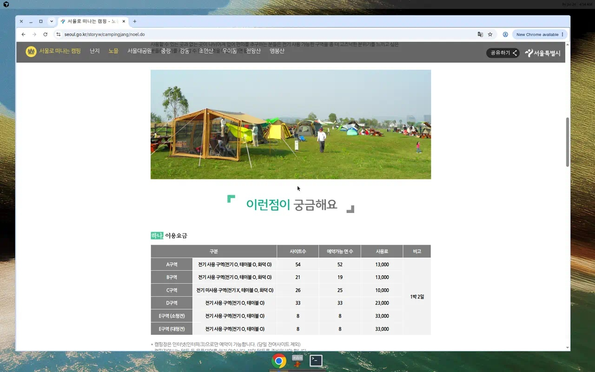
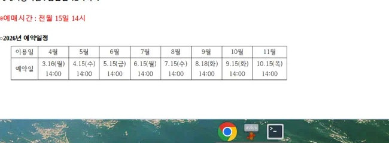
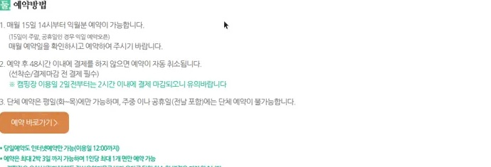
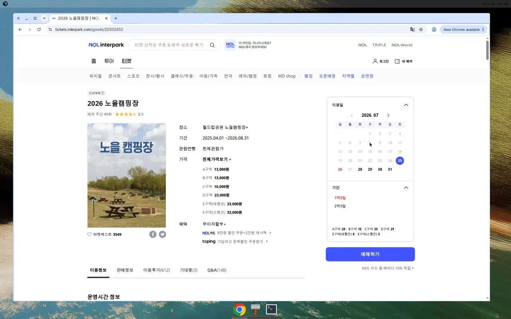
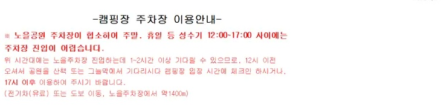
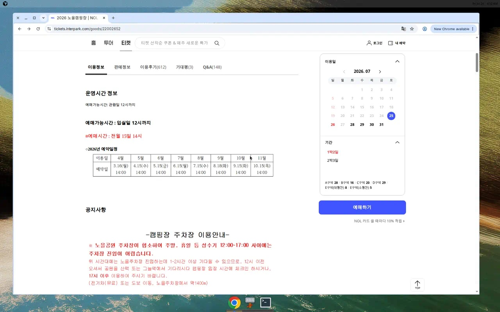
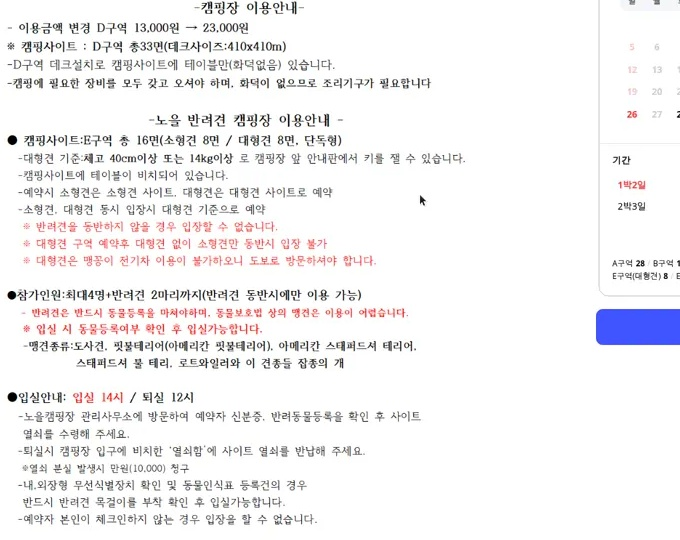
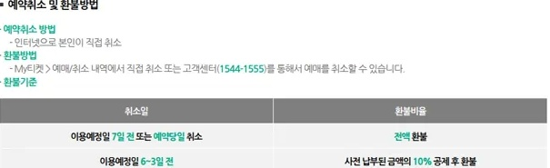

월드컵공원 안의 **노을캠핑장**은 서울에서도 노을·야경을 가까이에서 볼 수 있어, 예약 오픈만 되면 금방 자리가 사라지는 곳입니다.  
이 글은 서울시 공식 안내와 인터파크(NOL 티켓) 예매 화면을 기준으로, **초등학생도 따라할 수 있게** 클릭 순서·유의사항·매점 정보를 정리했습니다.

### 한 줄 요약
- **예매 채널**: 인터넷(인터파크)만 가능
- **오픈**: 매월 **15일 14:00**에 다음 달분 오픈 (15일이 주말·공휴일이면 익일)
- **결제**: 예약 후 보통 **48시간 이내** (이용일 2일 전부터는 **2시간 이내**)
- **핵심**: 텐트 대여 없음 · 오토캠핑 아님 · C구역은 전기 없음
- **입실/퇴실**: 당일 **14:00** ~ 다음날 **12:00** (22:00 이후 입장 불가)

### 노을캠핑장이 뭐예요?
노을캠핑장은 서울 마포구 월드컵공원 **노을공원** 안에 있는 가족 단위 야영장입니다.  
이름은 말 그대로, 노을로 물드는 서울 풍경을 보라는 뜻에 가깝습니다.

다만 일반 “차 옆에 텐트 치는 오토캠핑장”과는 다릅니다.

- 주차장에서 사이트까지 **짐을 직접 옮겨야** 합니다 (유료 전기차 또는 도보 약 1.4km)
- 캠핑장에서 **텐트·장비 대여를 하지 않습니다** → 본인 텐트를 준비해야 합니다
- 구역마다 **전기 사용 여부·요금**이 다릅니다

공식 소개: [서울로 떠나는 캠핑 - 노을 캠핑장](https://www.seoul.go.kr/storyw/campingjang/noel.do)

### 구역·요금 한눈에 보기 (공식 기준)
아래는 서울시 공식 안내 기준입니다. 실제 예매 화면의 잔여 면수·요금은 변동될 수 있으니, 예약 직전에 한 번 더 확인하세요.

| 구역 | 특징 | 예약가능 면(안내) | 사용료(1박 2일) |
| --- | --- | ---: | ---: |
| A구역 | 전기 O, 테이블 O, 화덕 O | 52 | 13,000원 |
| B구역 | 전기 O, 테이블 O, 화덕 O | 19 | 13,000원 |
| C구역 | **전기 X**, 테이블 O, 화덕 O | 25 | 10,000원 |
| D구역 | 전기 O, 테이블 O | 33 | 23,000원 |
| E구역(소형견) | 전기 O, 테이블 O | 8 | 33,000원 |
| E구역(대형견) | 전기 O, 테이블 O | 8 | 33,000원 |

**초보 TIP**
- 전기·편의 시설이 필요하면 **A·B·D**
- 조용한 분위기·랜턴 캠핑이면 **C** (대신 파워스테이션/랜턴 필수)
- 반려견은 **E구역만** (일반 구역과 규칙이 다름)

### 언제 열리나요? (2026 예약 일정)
원칙은 **전월 15일 14시**입니다.  
다만 15일이 주말·공휴일이면 다음날로 미뤄집니다. 인터파크 이용정보에 공개된 2026년 일정은 아래와 같습니다.

| 이용월 | 예약 오픈 |
| --- | --- |
| 4월 | 3.16(월) 14:00 |
| 5월 | 4.15(수) 14:00 |
| 6월 | 5.15(금) 14:00 |
| 7월 | 6.15(월) 14:00 |
| 8월 | 7.15(수) 14:00 |
| 9월 | 8.18(화) 14:00 |
| 10월 | 9.15(화) 14:00 |
| 11월 | 10.15(목) 14:00 |

운영 기간(공식): **4월 1일 ~ 11월 30일**, **매주 월요일 휴장**  
(월요일이 휴일이면 익일 휴장 등 예외가 있을 수 있습니다.)

---

### STEP 0. 오픈 전에 준비할 것 (여기가 제일 중요)
주말 자리는 “클릭 속도”보다 **준비**가 더 중요합니다. 14:00 5~10분 전에 끝내 두세요.

1. 인터파크(NOL) **회원가입·로그인** 완료
2. 결제 카드/간편결제 등록 확인
3. 원하는 **날짜 1순위 + 대체 날짜 2순위** 적어두기
4. 원하는 **구역 우선순위** 정하기 (예: A → B → D)
5. PC 브라우저와 스마트폰 앱을 같이 열어두면 편합니다

> TIP: 오픈 직후에 “어느 자리가 예쁘지?”를 고민하면 늦습니다.  
> **고민은 전에, 클릭은 후에.**

---

### STEP 1. 인터파크 예매 페이지 들어가기
아래 링크로 들어갑니다.

- 예매: [인터파크 2026 노을캠핑장](https://tickets.interpark.com/goods/22002652)
- 안내: [서울시 노을 캠핑장 소개](https://www.seoul.go.kr/storyw/campingjang/noel.do)

화면에 **「2026 노을캠핑장」** 제목, 구역별 가격, 오른쪽 달력이 보이면 맞습니다.

---

### STEP 2. 이용일·기간 고르기
오른쪽 달력에서 원하는 날을 누릅니다.

1. **이용일** 클릭
2. **기간**에서 `1박 2일` 또는 `2박 3일` 선택  
   - 최대 예약은 **2박 3일**까지
   - **1인당 1개 면**만 예약 가능
3. 아래에 구역별 잔여 면수가 보이면, 대략적인 여유를 확인할 수 있습니다
4. 파란 **「예매하기」** 버튼 클릭

당일 예약도 인터넷으로만 가능하며, **이용일 12:00까지**입니다.

---

### STEP 3. 구역·사이트 선택 후 결제
「예매하기」를 누르면 보통 구역/사이트 선택 화면으로 이어집니다.  
(작성 시점에는 좌석·사이트 선택 단계가 일시적으로 점검 화면으로 넘어가는 경우도 있어, 안 열리면 잠시 뒤·다른 기기에서 다시 시도해 보세요.)

순서만 기억하면 됩니다.

1. 원하는 **구역** 고르기
2. 지도/목록에서 **빈 사이트** 클릭
3. 예약자 정보 확인 (입장 시 본인확인이 있으니 **실제 이용자 이름**으로)
4. **결제 완료**까지 끝내기

**결제 마감 (공식)**
- 일반: 예약 후 **48시간 이내** 미결제 시 자동 취소
- 이용일 **2일 전부터**: **2시간 이내** 결제 마감

결제가 끝나야 진짜 예약 완료입니다.  
확인은 인터파크 **My티켓 → 예매/취소 내역**에서 하세요.

---

### STEP 4. 당일 이용 순서
1. **14:00**부터 체크인 (22:00 이후 입장 불가)
2. 관리사무실에서 **예약자 본인 + 신분증** 확인
3. 사이트 키 수령 후 이동
4. 다음날 **12:00**까지 퇴실, 키 반납

주차는 성수기·주말에 특히 붐빕니다. 인터파크 공지 기준으로 노을공원 주차장은 **12:00~17:00** 진입이 매우 어렵고, 1~2시간 이상 기다릴 수 있습니다.  
가능하면 **12시 이전**에 와서 공원에서 기다리거나, **17시 이후** 입장을 고려하세요.

---

### 유의사항 (놓치면 아쉬운 것)
공식·예매 페이지에 반복해서 나오는 포인트만 골랐습니다.

**예약·이용**
- 인터넷(인터파크) 예약만 가능
- 최대 2박 3일, 1인 1면
- 단체 예약은 **화~목 평일만** (주말·공휴일·전날 불가)
- 우천(장마)만으로는 당일 취소·변경이 되지 않습니다
- 기상특보(호우·태풍 등) 발령 시 운영 중단·전액 환불될 수 있습니다

**현장**
- 오토캠핑 아님 → 폴딩 카트 추천
- 텐트·장비 대여 없음
- C구역은 전기 없음
- 공원 내 이동은 유료 전기차 또는 도보

**반려견(E구역)**
- 반려견 없이 E구역 입장 불가
- 소형견/대형견 구역을 맞게 예약해야 함
- 대형견 기준 예시: 체고 40cm 이상 **또는** 체중 14kg 이상
- 동물등록·인식표 확인, 사이트당 인원·견수 제한이 있음
- 위험견종(토사견, 핏불테리어 등 및 믹스) 입장 불가 안내가 있음

### 매점·판매 정보
캠핑장 안에는 **매점(노을카페로 불리는 경우도 있음)**이 있어, 음료·과자·라면·부탄가스·일회용품 같은 **간단한 보충용품**을 사는 데 쓰는 경우가 많습니다.  
다만 재고·운영시간은 시즌·요일에 따라 달라질 수 있고, **주류·조리음식은 기대하지 않는 편이 안전**합니다.

**준비 추천**
- 주식·고기·채소·주류는 입장 전 마트/편의점에서
- 숯·착화제·모기약·휴지는 여유분 챙기기
- “없으면 매점에서 사면 되지”라고 전부 맡기지 말기

상암 인근 대형마트·편의점을 체크인 전에 들르는 동선이 흔합니다. 일요일 휴무 여부도 미리 확인하세요.

### 취소·환불
본인이 인터넷으로 직접 취소하거나, 고객센터(1544-1555)를 이용할 수 있습니다.

| 취소 시점 | 환불 |
| --- | --- |
| 이용예정일 7일 전 또는 예약당일 취소 | 전액 환불 |
| 이용예정일 6~3일 전 | 10% 공제 후 환불 |
| 이용예정일 2~1일 전 | 30% 공제 후 환불 |
| 이용 당일 | 환불 불가 |

기상특보로 운영이 전면 중단되면 전액 환불되는 경우가 있습니다.  
대기오염특보(황사·미세먼지 등)는 본인 희망 취소·전액 환불이 안내되는 경우가 있으니, 해당일에는 관리자·인터파크 고객센터에 확인해 보세요.

### 자주 모르는 질문 (FAQ)
**Q1. 회원가입 없이도 예약되나요?**  
아니요. 인터파크 로그인 후 예매·결제가 필요합니다.

**Q2. 친구 이름으로 대신 예약해도 되나요?**  
입장 시 예약자 본인 확인이 있습니다. **실제 이용자 이름**으로 예약하세요.

**Q3. C구역은 왜 싸나요?**  
전기가 없기 때문입니다. 랜턴·배터리·파워스테이션을 준비하면 됩니다.

**Q4. 비가 오면 자동 취소되나요?**  
아니요. 우천만으로는 당일 취소·변경이 되지 않습니다. 특보·안전 사유로 운영 중단될 때만 별도 환불 기준이 적용됩니다.

**Q5. 주차는 사이트 옆에 되나요?**  
오토캠핑장이 아닙니다. 노을공원 주차장에 두고, 전기차(유료) 또는 도보로 이동합니다.

### 관련 소식·공식 링크
- [서울시 - 서울로 떠나는 캠핑(노을 캠핑장)](https://www.seoul.go.kr/storyw/campingjang/noel.do)
- [인터파크 티켓 - 2026 노을캠핑장 예매](https://tickets.interpark.com/goods/22002652)

### 한눈에 정리
1. 매월 15일(또는 익일) **14:00**에 인터파크에서 다음 달분을 예매한다  
2. 날짜 → 기간 → 예매하기 → 구역/사이트 → **결제까지** 끝낸다  
3. 텐트는 직접 준비하고, C구역이면 전기를 포기하는 대신 요금이 낮다  
4. 주말 주차는 12~17시가 가장 막히니 시간 전략이 필요하다  
5. 매점은 “비상용 보충”으로만 생각하고, 주식·주류는 미리 산다  

*이 글은 공식 안내와 예매 화면을 바탕으로 한 정보성 정리이며, 요금·일정·규정은 변경될 수 있습니다. 예약 전 인터파크·서울시 페이지를 다시 확인하세요.*
